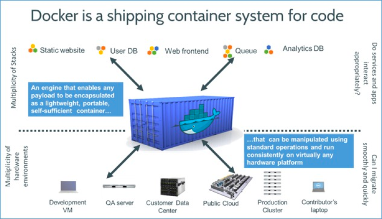

# Docker_for_ML-Models

- In this article, we will learn about Container technology and Docker and how to use them to package any application
- We will containerize a machine-learning application using docker and will push the created Docker image to DockerHub to be available to others

### Requirements :

- Python
- Flask
- Machine learning

# Docker Terminolories and Knowledge :

### 1 ) Docker

Docker is a container management tool, which packages the application code, configuration, and dependencies into a portable image that can be shared and run on any platform or system. 

### 2 ) Docker Engine :

Docker Engine enables containerized applications to run anywhere consistently on any infrastructure, solving “dependency hell” for developers and operations teams, and eliminating the “it works on my laptop!” problem.

### 3 ) Docker Installation

Docker is an open platform for developing, shipping, and running applications. Docker enables us to separate our applications from our infrastructure so we can deliver software quickly.

We can download and install Docker on multiple platforms. Refer to the official Docker page to install Docker based on the operating system in your local system.

### 4 ) Dockerfile

A simple file that consists of instructions to build a Docker Image. Each instruction in a docker file is a command/operation, for example, what operating system to use, what dependencies to install or how to compile the code, and many such instructions which act as a layer.

### 5) Docker Image

Once a docker file is created, we can build a docker image from it. Docker Image provides the execution environment for an application, bundling all necessary code, config files, and dependencies.

### 6 ) Docker Registry

Once the docker image is built and tested, we can share it with others so that they can use our application. For that, we need to push the docker image to the public docker image registry such as DockerHub, Google Container Registry(GCR), or any other registry platforms.

# Reference Link :

* [More Details ](https://www.analyticsvidhya.com/blog/2021/06/a-hands-on-guide-to-containerized-your-machine-learning-workflow-with-docker/)

# Commands :

      docker version
      docker ps -a
      docker images
      docker build -t breast_cancer_class:1.0 .
      docker run -p 5000:3000 breast_cancer_class:1.0
      docker ps
      docker run -d -p 5000:3000 breast_cancer_class:1.0

